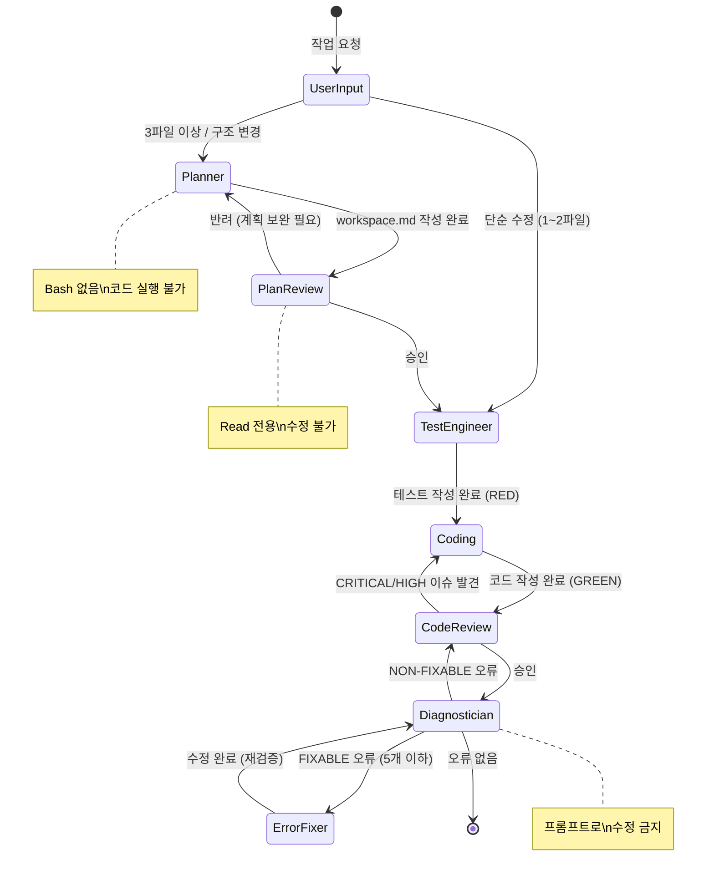

# Claude 기반 AI 에이전트 오케스트레이션 시스템

## 개요

Claude Code CLI를 기반으로 AI 에이전트가 계획·검증·수정을 분담하는 개발 자동화 시스템.

기획·품질·테스트 3개 팀, 9개 에이전트로 역할 분리. 프롬프트가 아닌 **도구(Tools) 권한으로 역할 이탈을 구조적으로 차단**하는 것이 핵심 설계 포인트.

---

## 에이전트 구성

| 팀 | 에이전트 | 역할 | 도구 제한 |
|---|---|---|---|
| 기획 | planner | 요구사항 인터뷰 → 계획서 작성 | Bash 없음 (코드 실행 불가) |
| 기획 | plan-reviewer | 계획 검토 · 승인/반려 | Read 전용 (계획 수정 불가) |
| 기획 | doc-updater | README · 코드맵 생성 | - |
| 품질 | code-reviewer | OWASP 보안 포함 코드 검토 | - |
| 품질 | error-fixer | FIXABLE 오류 수정 | - |
| 품질 | refactor-cleaner | 미사용 코드 탐지 · 제거 | - |
| 테스트 | diagnostician | 빌드/타입/린트 실행 → 오류 분류 | Bash 있음 (프롬프트로 수정 금지) |
| 테스트 | test-engineer | TDD 기반 테스트 작성 | - |
| 테스트 | e2e-runner | Playwright E2E 테스트 | - |

---

## 시스템 흐름 (FSM)

---

## 핵심 철학

> "더 좋은 프롬프트가 아니라, AI가 스스로 틀렸다는 걸 알아차릴 수 있는 환경을 만드는 것"
