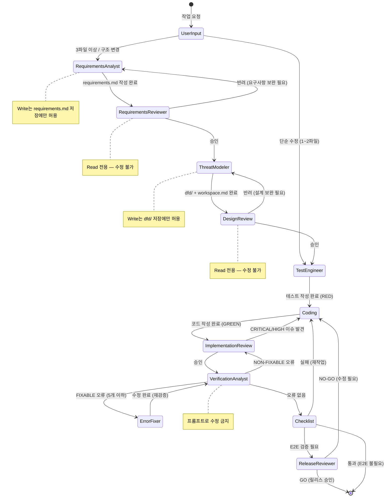

# Claude 기반 AI 에이전트 오케스트레이션 시스템

## 개요

Claude Code CLI를 기반으로 AI 에이전트가 계획·검증·수정을 분담하는 개발 자동화 시스템.

기획·품질·테스트 3개 팀, 11개 에이전트로 역할 분리. 프롬프트가 아닌 **도구(Tools) 권한으로 역할 이탈을 구조적으로 차단**하는 것이 핵심 설계 포인트. SDLC 단계별로 에이전트가 배치되어 각 단계를 책임진다.

---

## 에이전트 구성

| SDLC 단계 | 에이전트 | 역할 | 없는 도구 | 모델 |
|---|---|---|---|---|
| Requirements | requirements-analyst | 사용자 인터뷰 → 요구사항 확정 | Bash, Edit 없음 / Write는 requirements.md 저장에만 | opus |
| Requirements 검토 | requirements-reviewer | 요구사항 검토 · 보안 누락 확인 · 승인/반려 | Bash, Write, Edit (읽기만 가능) | opus |
| Design | threat-modeler | 요구사항 → DFD + Sequence Diagram + STRIDE 위협 모델 | Bash, Edit 없음 / Write는 dfd/ 저장에만 | opus |
| Design 검토 | design-reviewer | 설계 검토 · 위협 모델 검증 · 승인/반려 | Bash, Write, Edit (읽기만 가능) | opus |
| Implementation | error-fixer | FIXABLE 오류 수정 | - | sonnet |
| Implementation 검토 | implementation-reviewer | OWASP 보안 포함 코드 검토 | Write, Edit (수정 불가, 검토만) | opus |
| Verification | test-engineer | TDD 기반 테스트 작성 | Glob | opus |
| Verification | verification-analyst | 빌드/타입/린트 실행 → 오류 분류 | - | sonnet |
| Release | release-reviewer | E2E 테스트 · 릴리스 게이트 GO/NO-GO | - | sonnet |
| Maintenance | response-analyst | 미사용 코드 탐지 · 제거 | - | sonnet |
| Maintenance | doc-updater | README · 코드맵 생성 | - | sonnet |

---

## SDLC 단계별 구조

| SDLC 단계 | 담당 | 검토 | 훅 |
|-----------|------|------|-----|
| Requirements | requirements-analyst | requirements-reviewer | 보안 기본 체크 + 누락 확인 |
| Design | threat-modeler | design-reviewer | 보안 기본 체크 + 누락 확인 |
| Implementation | Claude 본체 | implementation-reviewer + error-fixer | 보안 기본 체크 + 누락 확인 |
| Verification | test-engineer + verification-analyst | (verification-analyst가 검토) | 보안 기본 체크 |
| Release | release-reviewer | (release-reviewer가 GO/NO-GO) | 보안 기본 체크 |
| Maintenance | response-analyst + doc-updater | - | - |

---

## 시스템 흐름 (FSM)

---

## 핵심 철학

> "더 좋은 프롬프트가 아니라, AI가 스스로 틀렸다는 걸 알아차릴 수 있는 환경을 만드는 것"
